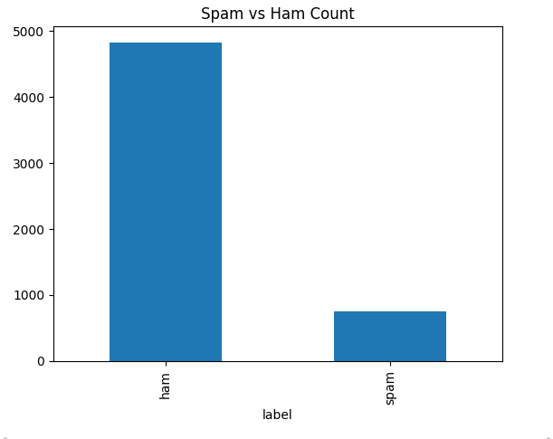

# 📧 Spam Email Detection

This is a Machine Learning project that classifies messages as Spam or Ham using Natural Language Processing (NLP).

## 🚀 Features
- Data cleaning and preprocessing
- Data visualization
- Text vectorization using CountVectorizer
- Model training using Naive Bayes
- Accuracy ~97%

## 🛠️ Tech Used
- Python
- Pandas
- Scikit-learn
- Matplotlib

## 🤖 How It Works
1. The dataset contains SMS messages labeled as spam or ham.
2. Text data is converted into numerical form using CountVectorizer.
3. A Naive Bayes model is trained on the data.
4. The model predicts whether a new message is spam or not.

## 📊 Results
The model successfully classifies spam messages with high accuracy.

## 📌 Example
Input: "Win money now!!!"  
Output: Spam

## 📂 Project Structure
- data/
- notebooks/
- README.md

## 📊 Visualizations

